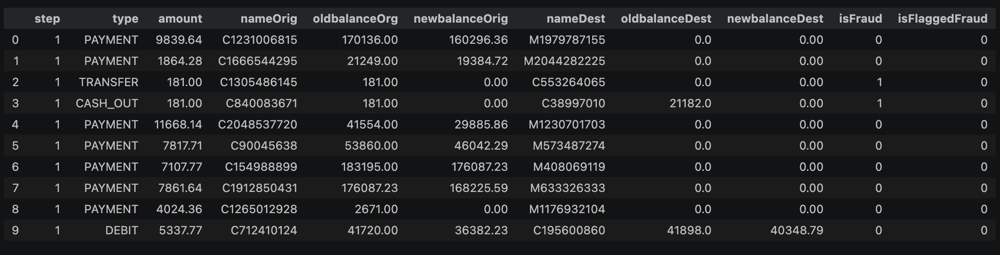
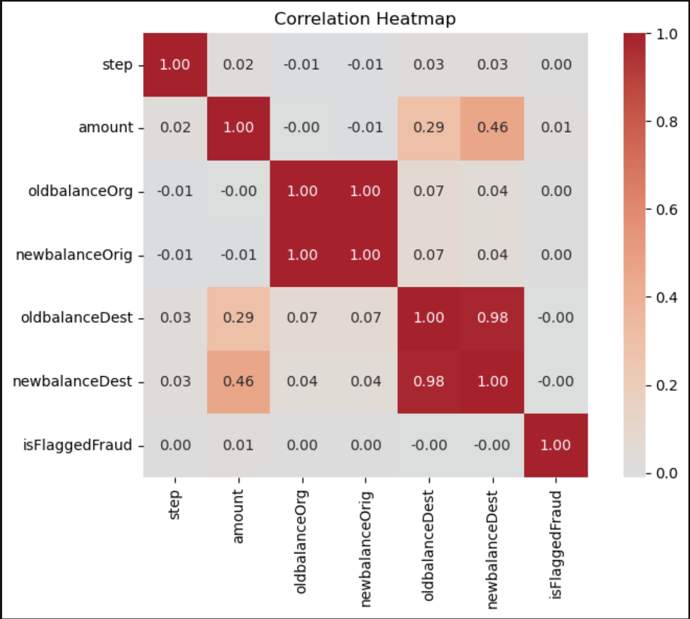
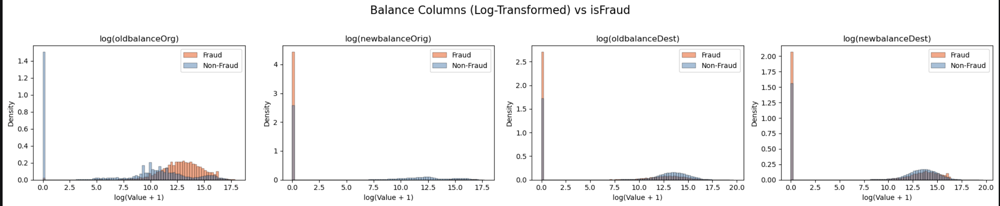
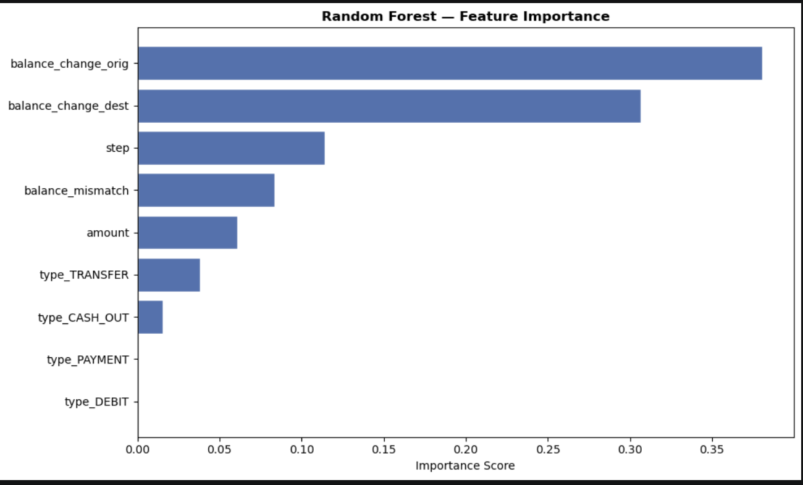
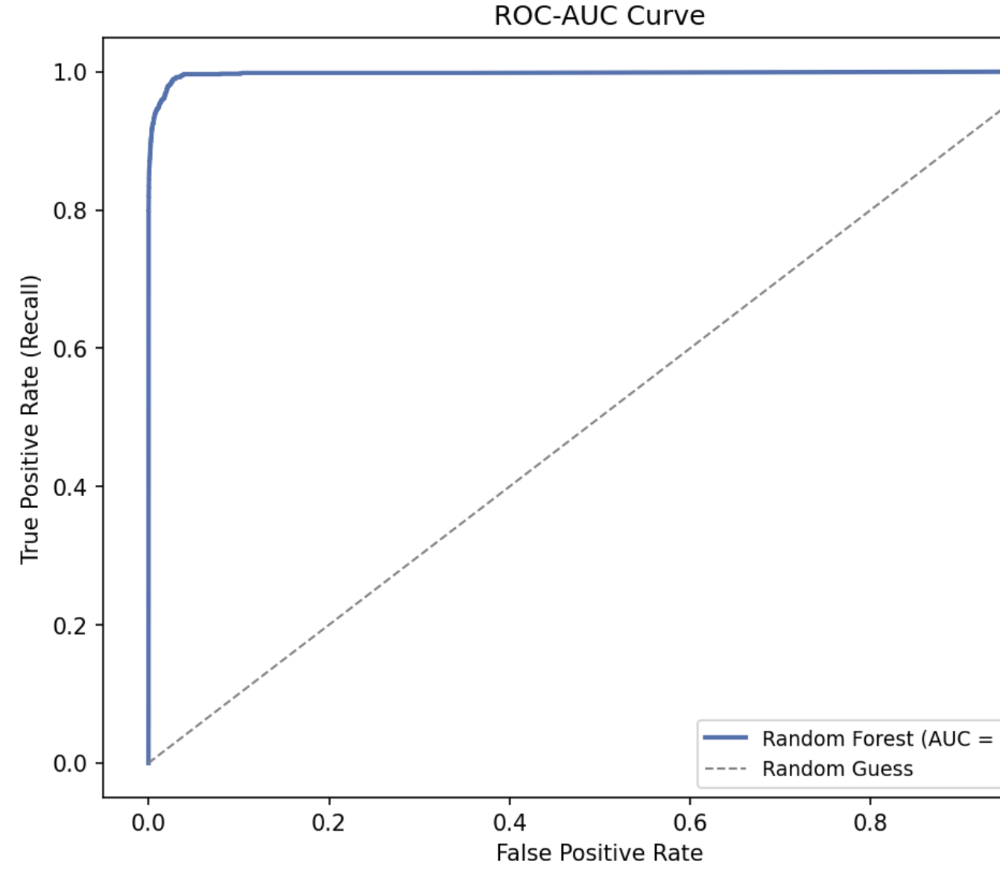

# Financial Fraud Detection Project
Fraud happens quietly, often when and where you least expect it — and that subtlety is exactly what makes detection challenging. If we _flag everything_ as fraud, we drown in false alarms but if we _don't flag anything_ as fraud, we’ll miss every real case. The challenge comes from finding the rare suspicious cases hiding in a sea of normal activities.

In this project, I've been assigned a role as data scientist at Caishen, an international bank in NYC, and the cybersecurity team has handed us historical fraud data. I'll be taking you with me through this project (I mean, OUR project).\
Now it’s our job to turn it into a minimal viable product (MVP), analyzing the dataset of bank transactions then building an ensemble classifier (such as random forest or boosted model) that can decide whether a transaction is likely to be fraudulent.

Information on the the data features are in this link: [Features Information](docs/features_info.txt)\
Since Github blocks file uploads larger than 100 MB, we will not be including the actual dataset within this repository. But you can see the first few rows of the data here: 

Final Report [Q&A](docs/report_qa.txt)

---

This project is split into three sections:

### 1. EDA
During EDA we find that our dataset has 11 columns and 6 million+ bank transactions.
After doing univariate, bivariate, and multivariate analysis, we find that we have better chance in creating a good model that catches fraudulent transactions when we combine with other features. 

As the correlation map above shows, we also found that individual correlations with isFraud were all low, combinations of these features showed much stronger fraud signals than any individual feature alone. 

After plotting and exploring the data, we find that not only was our target variable highly skewed but so were the balances before and after a transfer.
An interesting plot of the balances are shown below:

Even though our data is really skewed, with the help of log-transform, we were able to pinpoint some suspicious behaviors that presents a stark difference when compared with real transactions:
- in newBalanceOrig, we find that fraudsters do not keep money in their account after transferring.
- oldBalanceOrg could also be useful, suggesting that *most* fraudsters start accounts with huge amounts.

You can find more details on other feature explorations throughout the project or through this [Q&A](docs/report_qa.txt).

### 2. Cleaning, Wrangling, and Preprocessing
During preprocessing, 1,156 duplicate rows were identified after dropping the account ID columns nameOrig and nameDest. However, upon inspection, dropping these duplicates reduced our fraud transactions from 8,213 to 8,124 - a loss of 89 fraudulent transactions. Given the severe class imbalance in this dataset (only 0.13% of transactions are fraudulent), every fraud case is valuable for model training. Therefore, retaining these duplicate rows to preserve as many fraud examples as possible was the idea the project went with.
Dropping these duplicates is an opportunity for future exploration when optimizing the models.

We also engineered three new features (balance_delta_orig, balance_delta_dest, and balance_mismatch) to directly capture the fraud patterns identified in EDA.

After creating these new features, we dropped the original balances features (newBalanceOrig, oldBalanceOrg, newBalanceDest, oldBalanceDest) because they were already captured by the new engineered features.

We also applied one-hot encoding to column type and retained duplicate rows to preserve all 8,213 fraud cases given severe class imbalance.

### 3. Creating and Hypertuning Model
|  | Score 
| ------ | ------ 
| Baseline F1-Score | 0.8488
| Tuned F1-Score | 0.8437
| AUC | 0.9972

The baseline model we created produced an F1 Score of 0.8488.
The hyperparameter tuning did not have a huge impact on the model's performance. Using the best parameters:\
*n_estimators=200, max_depth=10, min_samples_split=5, min_samples_leaf=1, and class_weight=None*,\
the baseline model did slightly better than the tuned model by 0.005. This seems backwards but this is explained by the fact that the tuned model is more honest than a single train/test split. Cross Validation split the data into 5 different ways and averages the score, which makes the tuned model's F1 Score more reliable.

The above chart confirms what we found in EDA. The two features we engineered (balance_change_orig and balance_change_dest) turned out to be the most useful for the model, which makes sense since fraudsters consistently drain accounts completely. step, balance_mismatch, and amount contributed moderately, while type_PAYMENT and type_DEBIT scored near zero were expected since those transaction types had no fraud cases at all.

Our model's precision is 96%, meaning that when it flags a transaction as fraud, it is right almost every time, very few false alarms. However, the model misses 423 actual fraud cases, which is 25.75% of all real fraud in our test set, a low recall. 

The AUC score of 0.9972 means that the model is actually very good at identifying which transactions look suspicious. The issue is that by default, the model only flags something as fraud if it is at least 50% confident. Some of the 423 missed fraud cases are likely sitting just below that 50% cutoff. By lowering the decision threshold from 0.50 to 0.30, recall improved from 74.25% to 77% while precision only dropped slightly from 96% to 94%. This simple adjustment required no retraining and resulted in a minimally better F1 score of 0.8462.

 
In short, the F1 score tells us how the model performs at the 50% cutoff, while the AUC tells us how good the model is at ranking risk overall. The adjustment we made on the threshold also confirms that tuning it is a quick and effective way to optimize the precision-recall tradeoff for imbalanced datasets.

# Limitations & Future Improvements
- We attempted to train a GradientBoostingClassifier as a point of comparison, however due to the dataset size and limited computational resources, training exceeded two hours without completing. Notably, its baseline F1 score of 0.3682 suggests it would require more careful tuning and potentially a sampled dataset to be viable, making it a strong candidate for future exploration given more time and resources.
- The class imbalance of 0.13% fraud was handled through class weights, but applying SMOTE to synthetically oversample fraud cases could push recall higher beyond the current 74.25%, at the cost of some precision.
- Threshold tuning showed promise, lowering the decision threshold from 0.50 to 0.30 improved recall to 77% with slight precision loss. Further threshold optimization could be explored systematically.
- A GridSearchCV exhaustive search on the Random Forest model could yield better hyperparameters given sufficient computational resources.
